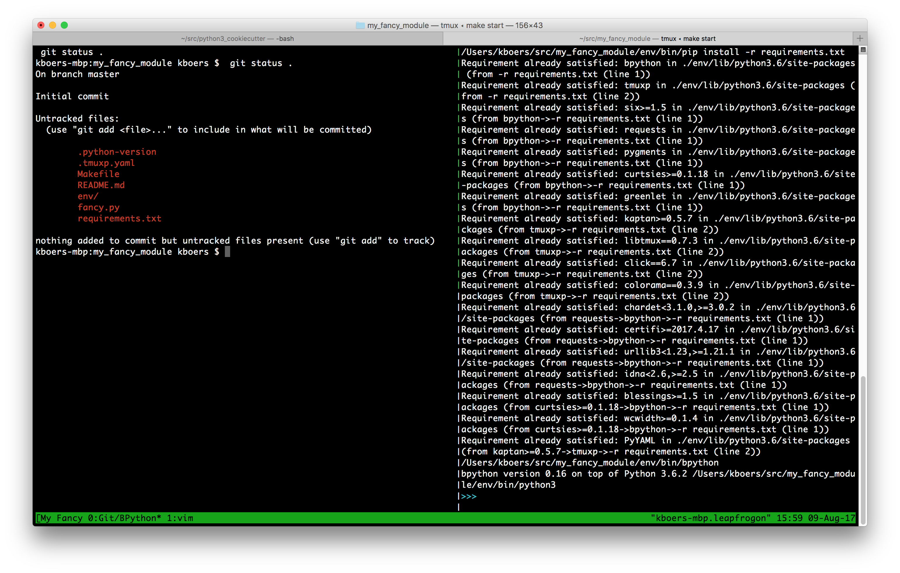
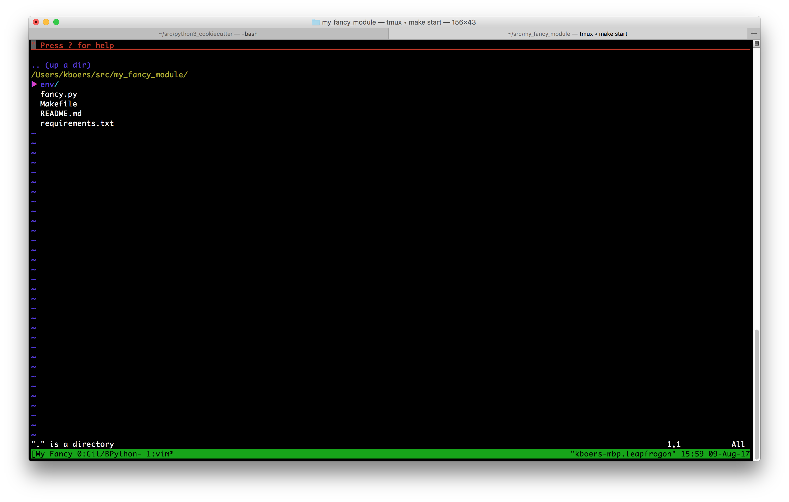

Kevbo's Python 3 Cookiecutter Template
======================================

This is a custom [cookiecutter](https://github.com/audreyr/cookiecutter) template that I use to bootstrap simple projects in Python 3. It includes a layout that represents my desired development environment (`vim`, `tmux`) and its usual artifacts (a README, a Makefile, a requirements file, etc.)

Prerequisites
-------------
* Recent copies of [pyenv](https://github.com/pyenv/pyenv) and [pipenv](https://github.com/pypa/pipenv) installed and on your PATH
* [tmux](https://github.com/tmux/tmux/wiki) (if you want to use my development environment)
* [vim](http://www.vim.org/) (Again, only if you want to use my development environment)
* [Cookiecutter](https://github.com/audreyr/cookiecutter)

To use
------

First, you'll want to make sure you've got [cookiecutter](https://github.com/audreyr/cookiecutter) installed. Personally, I don't like installing global libraries on my system, because I've got many versions of Python installed, and I don't want to have to make sure I've got the right one activated before I use a tool like this. Instead, I usually create a Python virtualenv in a subdirectory of my source folder, install the tool, and then alias it from my bash profile. For example:

    # Sandboxed Python Utils
    alias bp='/Users/kboers/src/bpython/env/bin/bpython'
    alias cookiecutter='/Users/kboers/src/cookiecutter/env/bin/cookiecutter'

You may also be interested in [pipsi](https://github.com/mitsuhiko/pipsi), which I think does the same thing.

Next, because this project specifies a Python major version in its `Pipfile`, you'll need to install [pyenv](https://github.com/pyenv/pyenv) for managing multiple versions of Python on your system. `pipenv` will read the desired version from `Pipfile` and then use that version (assuming you have it installed -- if not, pyenv will ask you to install it).

Now you should be able to run `cookiecutter` and pass it a string representing this GitHub repo:

    cookiecutter gh:kevbo/python3_cookiecutter

You might want to make sure you're in your source directory before you do this, because cookiecutter will create a new directory for you based on the module name you give it, and it will create that directory as a subdirectory of wherever you are. Personally, I have aliased this call to make my life easier and remove any chance of error:

    alias py3new='cd ~/src; cookiecutter gh:kevbo/python3_cookiecutter'

When you run that, cookiecutter will ask you some questions, and then generate a new project and start up the development environment:

    kboers-mbp:~ kboers $ py3new
    You've cloned /Users/kboers/.cookiecutters/python3_cookiecutter before. Is it okay to delete and re-clone it? [yes]: 
    project_name [The name of the project]: My Fancy Module
    project_slug [my_fancy_module]: 
    module_name [Module name, minus the .py]: fancy
    start_development_environment_after_creation [Yes]: 
    Project created in ./my_fancy_module!
    Starting development environment...
    python3 -m venv /Users/kboers/src/my_fancy_module/env
        <Dependencies from requirements.txt are installed>
    /Users/kboers/src/my_fancy_module/env/bin/tmuxp load .
    [Loading] /Users/kboers/src/my_fancy_module/.tmuxp.yaml

If you chose the default option to start the development environment, you will need `vim` and `tmux` installed. When the development environment launches, you will be in a `tmux` session with two windows. Window 1 will have two panes containing a command line and a [BPython](https://bpython-interpreter.org/) session. Window 2 will have a vim session.

To start up the development environment again, just run `make start` from the command line in the project directory.
